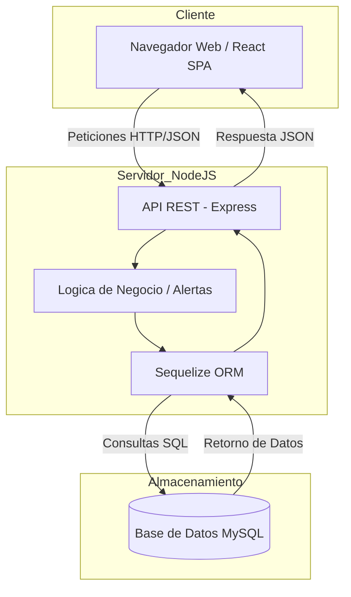
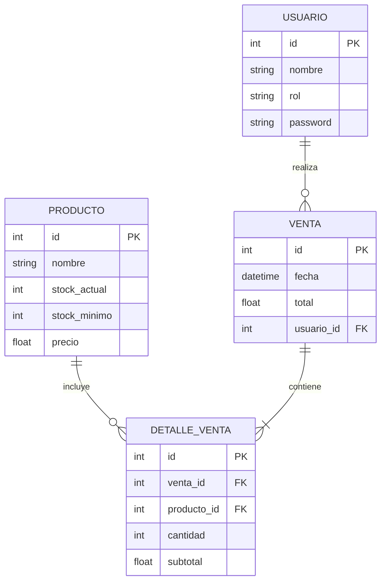
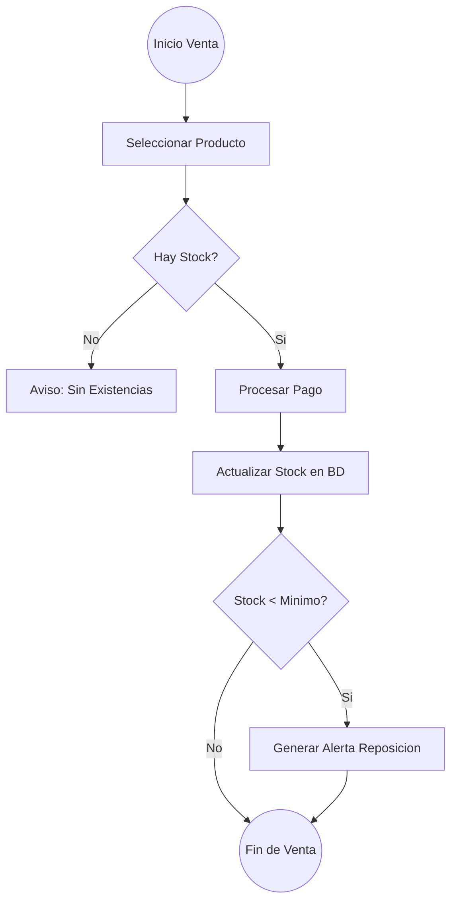

# Nova Salud Sync - Backend

Sistema de gestion farmaceutica centralizado para la botica Nova Salud. Este proyecto forma parte del entregable final para el curso de Full Stack Developer.

## Descripcion

Este es el servidor API REST construido con Node.js y Express encargado de la logica de negocio, gestion de inventarios, procesamiento de ventas y seguridad de los datos.

## Tecnologias utilizadas

- Node.js: Entorno de ejecucion para Javascript.
- Express: Framework para la creacion de la API REST.
- MySQL: Motor de base de datos relacional.
- Sequelize: ORM para la gestion y mapeo de la base de datos.
- JWT (JSON Web Tokens): Sistema de autenticacion segura.
- Bcrypt.js: Encriptacion de contrasenas de usuarios.

## Requisitos previos

- Node.js instalado.
- MySQL Server en ejecucion.

## Instalacion

1. Navegar a la carpeta del backend.
2. Ejecutar el siguiente comando para instalar las dependencias:
   npm install

3. Configurar el archivo .env con los siguientes parametros:
   PORT=3000
   DB_NAME=farmaplus_db
   DB_USER=tu_usuario
   DB_PASS=tu_password
   DB_HOST=localhost
   JWT_SECRET=tu_secreto_super_seguro

4. Asegurarse de haber ejecutado el script init.sql en su instancia de MySQL.

## Ejecucion

Para iniciar el servidor en modo desarrollo con recarga automatica:
npm run dev

El servidor estara disponible en http://localhost:3000

## Estructura de Rutas

- /api/auth: Gestion de usuarios y sesiones.
- /api/productos: Control de stock, alertas de reposicion y CRUD de medicamentos.
- /api/ventas: Registro de transacciones con transacciones ACID y consulta de historial detallado.

## Visualizacion del Sistema

A continuacion se presentan los diagramas que describen la estructura y el funcionamiento de Nova Salud Sync.

### 1. Diagrama de Arquitectura (Capa Fullstack)

### 2. Diagrama de Entidad-Relacion (Base de Datos)

### 3. Diagrama de Flujo: Proceso de Venta y Alerta

